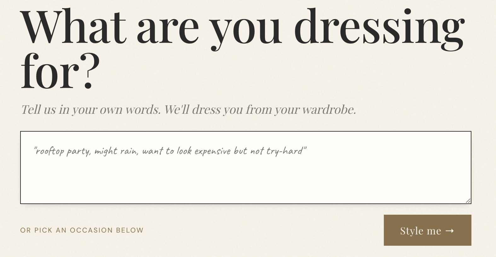
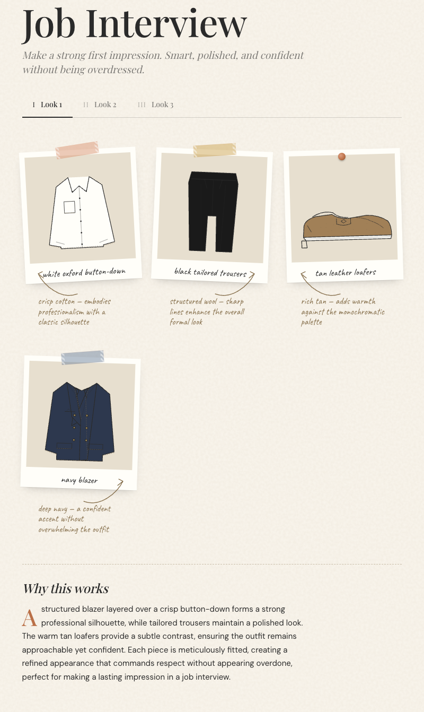
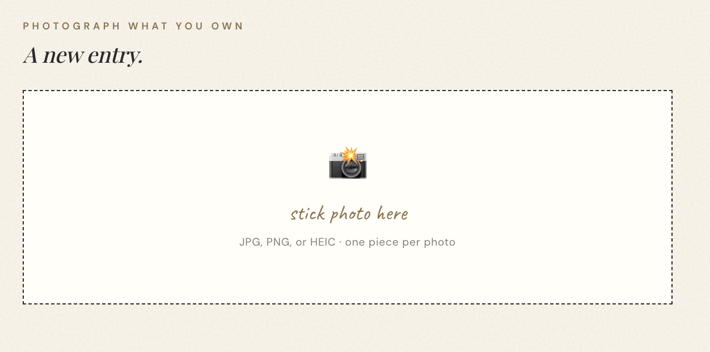
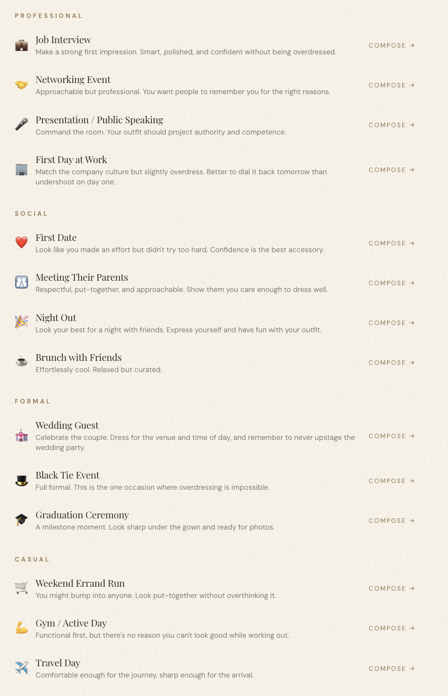
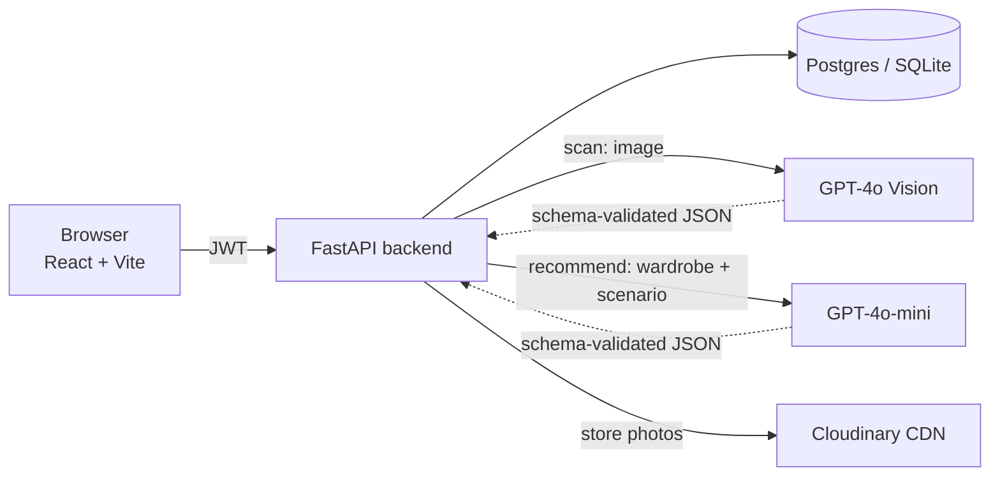

# Seynario — Dress for the Scenario


A full-stack AI-powered wardrobe scanner and outfit recommendation engine. Users photograph their clothes, AI identifies each garment, then recommends complete outfits tailored to specific scenarios, such as: job interviews, first dates, nights out, weddings, and more.

**Live:** [seynario.seyn.co.uk](https://seynario.seyn.co.uk) · [Privacy](https://seynario.seyn.co.uk/privacy)

## Screenshots

<p align="center">
  
</p>

<p align="center">
  
</p>

| Scan your wardrobe | Or pick a curated occasion |
|---|---|
|  |  |

## Architecture



Every AI response is validated against a Pydantic schema (one corrective retry, then clean failure) before touching the database. Upload validation, per-user daily quotas, per-IP rate limits, an app-wide daily spend ceiling, and image dedup keep API costs bounded — see the changelog below.

 
## How It Works
 
Seynario uses **GPT-4o Vision** to identify garments from photos and **GPT-4o-mini** to generate scenario-specific outfit recommendations from the user's wardrobe.
 
1. **Scan** — Photograph a clothing item. AI identifies the type, colour, material, pattern, season, and formality level.
2. **Pick a scenario** — Choose from 14 real-life scenarios across 4 categories.
3. **Get styled** — AI recommends 2-3 complete outfits using your wardrobe, with rationale explaining *why* each piece works.
4. **Fill the gaps** — Missing a key piece? Seynario suggests what to buy.
 
Scenarios are grouped into 4 categories:
 
- **Professional** — Job Interview, Networking Event, Presentation, First Day at Work
- **Social** — First Date, Meeting Their Parents, Night Out, Brunch with Friends
- **Formal** — Wedding Guest, Black Tie Event, Graduation Ceremony
- **Casual** — Weekend Errand Run, Gym / Active Day, Travel Day
 
## Tech Stack
 
| Layer | Technology | Purpose |
|-------|-----------|---------|
| Frontend | React + Vite | Component-based UI with React Router |
| Backend | Python + FastAPI | Async REST API with auto-generated docs |
| Database | SQLite (dev) / PostgreSQL (prod) | Relational data via SQLAlchemy 2.0 |
| Auth | JWT (access + refresh tokens) | Stateless authentication with bcrypt |
| Vision AI | OpenAI GPT-4o | Identifies garments from photos |
| Text AI | OpenAI GPT-4o-mini | Generates outfit recommendations with rationale |
| Image Storage | Cloudinary | Stores and serves wardrobe photos |
 
## Features
 
- **AI wardrobe scanning** — Photograph a garment, get instant identification (category, colour, material, pattern, formality, season)
- **14 scenarios** — Job Interview, First Date, Night Out, Wedding Guest, Black Tie, Graduation, Travel Day, and more
- **Smart outfit recommendations** — Mixes items you own with purchase suggestions based on scenario requirements
- **Styling rationale** — Every recommendation explains why each piece works for the scenario
- **Wardrobe management** — Grid view with category filters, detail modal, edit and delete
- **Save outfits** — Bookmark recommendations for later
- **JWT authentication** — Secure register/login with token refresh
 
## Running Locally
 
### Backend
 
```
cd backend
python -m venv venv
source venv/bin/activate
pip install -r requirements.txt
cp .env.example .env
# Add your OpenAI API key, Cloudinary credentials, and generate a SECRET_KEY
python seed.py
uvicorn main:app --reload
```
 
### Frontend
 
```
cd frontend
npm install
npm run dev
```
 
Backend runs on `http://localhost:8000` (API docs at `/docs`)
Frontend runs on `http://localhost:5174`
 
### Tests
 
```
cd backend
ruff check app main.py tests
pytest
```
 
Tests cover auth (registration, login, expired-token rejection), upload validation, quota enforcement and daily reset, the global spend ceiling, scan dedup, AI output schema validation, and recommendation mapping. All OpenAI and Cloudinary calls are mocked — the suite never hits a live API. CI runs lint + tests + frontend build on every push and PR.
 
## API Cost
 
| Action | Model | Cost per call |
|--------|-------|---------------|
| Scan 1 garment | GPT-4o | ~$0.004 |
| Recommend outfits | GPT-4o-mini | ~$0.002 |
 
Scanning is a one-time cost per garment. At 100 users scanning 20 items each plus 5 recommendations per month, total API cost is approximately $9/month.
 
 

